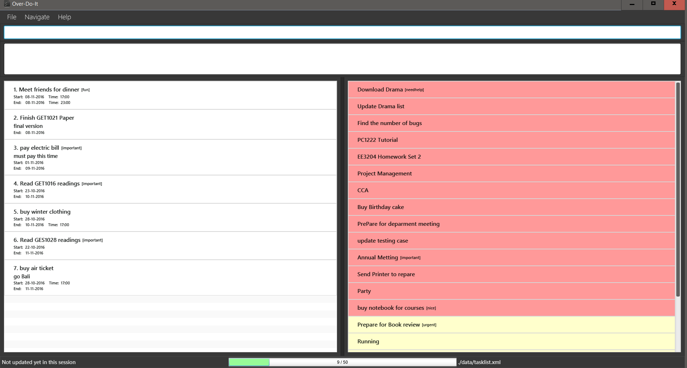

<!-- @@author A0146840E -->

# User Guide
 

* [Getting Started](#starting-the-program)
* [Introduction](#introduction)
   * [Tasklist](#tasklist)
   * [Task Card Indicator](#task-card-indicator)
* [Hotkeys](#hotkeys)
   * [Main Window](#main-window)
   * [Command](#command)
   * [Interactive Tasklist](#interactive-tasklist)
   * [Overall Tasklist](#overall-tasklist)
* [Commands](#commands)
   * [Help](#viewing-help--help)
   * [Add](#adding-a-task--add)
   * [List](#listing-tasks--list)
   * [Find](#finding-tasks--find)
   * [Storage](#set-storage-file-location--storage)
   * [Edit](#edit-a-task--edit)
   * [Delete](#deleting-a-task--delete)
   * [Select](#select-a-task--select)
   * [Mark](#mark-a-task--mark)
   * [Unmark](#unmark-a-task--unmark)
   * [Undo](#undo-a-task--undo)
   * [Time](#check-the-time-remaining--time)
   * [Clear](#clearing-all-entries--clear)
   * [Exit](#exiting-the-program--exit)
* [FAQ](#faq)
* [Command Summary](#command-summary)

 
## Starting the program

0. Ensure that you have installed Java version `1.8.0_60` or later on your computer. 
> This program will not work with earlier versions of java including java 8. 

1. Download the latest version of `Over-Do-It.jar` from the releases tab.

2. Copy the file to your desired folder.

3. Double click the file to start the application. The application should run and GUI should appear shortly.  

4. Type the command in the command box at the top and press <kbd>Enter</kbd> to execute the command. 
Type `help` followed by pressing <kbd>Enter</kbd> will open the help window.

5. Some example commands you can try:
   * **`add`** `CS2103 d/tutorial e/20102016` :
     adds a task named `CS2103` with a description of `tutorial` with a deadline of `20/10/16`.
   * **`delete`**` 1` : deletes the first item on the task list.
   * **`exit`** : exits the app

6. Refer to the [Commands](#commands) section below for details of each command. 

 
## Introduction

After startup, the application will always show overdue tasks, if any, and tasks for the next 7 days.

 
### Tasklist

Interactive tasklist (left panel) and Overall tasklist (right panel) are sorted in chronological order starting from the earliest date.

Sorted in order:

1. Overdue tasks

2. Normal tasks

3. Floating tasks

4. Completed tasks

 
### Task Card Indicator

**`Normal Task`** : White

> 

**`Completed Task`** : Pale Green

> 

**`Floating Task`** : Pale Yellow

> 

**`Overdue Task`** :  Pale Red

> 

 
## Hotkeys

 
### Main Window

>  <kbd>F1</kbd> : Help

>  <kbd>F11</kbd> : Fullscreen

 
### Command

> <kbd>Up</kbd> : Show previous command

> <kbd>Down</kbd> : Show previous command

 
### Interactive Tasklist

> <kbd>Home</kbd> : Scroll to top

> <kbd>End</kbd> :  Scroll to end

> <kbd>Page Up</kbd> : Scroll up

> <kbd>Page Down</kbd> : Scroll down

 
### Overall Tasklist

> <kbd>Ctrl</kbd> +  <kbd>Home</kbd> : Scroll to top

> <kbd>Ctrl</kbd> +  <kbd>End</kbd> : Scroll to end

> <kbd>Ctrl</kbd> +  <kbd>Page Up</kbd> : Scroll up

> <kbd>Ctrl</kbd> +  <kbd>Page Down</kbd> : Scroll down

 
<!-- @@author A0140019W -->
## Commands
> **Command Format**
> * Words in `UPPER_CASE` are the parameters.
> * Items in `SQUARE_BRACKETS` are optional.
> * Items with `...` after them can have multiple instances.
> * Order of parameters are fixed. 

 
### Viewing help : `help`
Format: `help`

> Help is also shown if you press <kbd>F1</kbd>
 
 
### Adding a task : `add`
If you want to add the a task to the TaskList, here are the format to follow 
Format: `add TITLE [d/DETAILS] [s/START DATE TIME] [e/END DATE TIME] [t/TAG]...`

> Title, details and tags are alphanumeric. Date and time are numeric.
>
> Date and time is in 24hr format : `DDMMYY HHMM`
> 
> Tasks can have any number of tags (including 0)
>
> Floating tasks can be added without any date and time

Examples: 
* `add CS1020 Tutorial d/many questions e/05102016 1200  t/needhelp`
* `add Meeting d/for project s/05102016 1200 e/05102016 1400 t/priority1`
* `add CS1010 Take home lab d/hard to do s/05102016 1200`
* `add CS2103 Project d/hard to do`
* `add CS1231 Mid-Term Test`
 

### Listing tasks : `list`
This command help you to lists the stipulated tasks in the task list  
Format: `list [PARAMETERS]`

> Parameters: completed, overdue, floating, today, week

Example:
* `list’ 
list all tasks
* `list completed’ 
list all completed tasks
* `list overdue’ 
list all overdue tasks
* `list floating’ 
list all floating tasks
* `list today’ 
list all tasks for the day
* `list week’ 
list all tasks for the week

 
### Finding tasks : `find`
If you want to find tasks whose title, description, date, time and tags contain any of the information you want to search for. 
Format: `find KEYWORD [MORE_KEYWORDS]`

> The search is case insensitive, the order of the keywords does not matter, only the title, description, date, time and tags are searched and tasks matching at least one keyword will be returned (i.e. `OR` search).

Examples: 
* `find cs2103` 
  Display tasks containing `CS2103` and `cs2103`
* `find cs1010 15 2016` 
  Display tasks containing `cs1010`, `15`, or `2016`
* `find lab` 
  Display tasks containing `lab`.

 
### Set storage file location : `storage`
Saving the TaskList to anywhere you want.  
Format: `storage FILEPATH`

> Task list data are saved in a file called `data\tasklist.xml` in the root folder by default.
> 
> The file name must end in `.xml` for it to be acceptable to the program.
>
> `Note`: The previous storage file will be deleted.
> 
> Irreversible with `undo`

Example: 
* `storage \folder\file.xml`  
  Storage file location has been changed to `\folder\file.xml`.
* `storage \data\newtasklist.xml`  
  Storage file location has been changed to `\data\newtasklist.xml`.

 
### Edit a task : `edit`
Edit any information you want to edit from the task  
Format: `edit INDEX [TITLE] [d/DETAILS] [s/STARTTIME] [e/ENDTIME]`

> Edit the task at the specified `INDEX`.   
> The index refers to the index number shown in the most recent listing. 
> The index **must be a positive integer** 1, 2, 3, ...

Examples:
* `list` 
  `edit 1 d/new updates` 
  Edits the 1st task in the task list, changing the task description to `new updates`.
* `list floating` 
  `edit 2 d/new updates e/051016 1200` 
  Edits the 2nd floating task in the task list, changing the task description to `new updates` and end date and time to `051016 1200`.

 
### Deleting a task : `delete`
Delete any task if you is not needed or not important 
Format: `delete INDEX`

> Deletes the task at the specified `INDEX`. 
> The index refers to the index number shown in the most recent listing.
> The index **must be a positive integer** 1, 2, 3, ...

Examples: 
* `list` 
  `delete 2` 
  Deletes the 2nd task in the task list.
* `find cs2103`  
  `delete 1` 
  Deletes the 1st task in the results of the `find` command.

 
### Select a task : `select`
Selects the task identified by the index number used in the last task listing. 
Format: `select INDEX`

> Select and display the information of the task.  
> The index refers to the index number shown in the most recent listing. 
> The index **must be a positive integer** 1, 2, 3, ...

Examples: 
* `list` 
  `select 2` 
  Selects the 2nd task in the task list.
* `find CS2103`   
  `select 1` 
  Selects the 1st task in the results of the `find` command.

 
<!-- @@author A0138516A -->
### Mark a task : `mark`
You can mark the task as completed at the specified ‘INDEX’. 
Format: `mark INDEX`

> Mark the task as completed.  
> The index refers to the index number shown in the most recent listing. 
> The index **must be a positive integer** 1, 2, 3, ...

Examples: 
* `list` 
  `mark 2` 
  Marks the 2nd task in the task list.
* `find CS2103`   
  `mark 1` 
  Marks the 1st task in the results of the `find` command.

 
### Unmark a task : `unmark`
You can unmark the task as not completed at the specified ‘INDEX’. 
Format: `unmark INDEX`

> Mark the task as not completed.  
> The index refers to the index number shown in the most recent listing. 
> The index **must be a positive integer** 1, 2, 3, ...

Examples: 
* `list` 
  `unmark 2` 
  Unmarks the 2nd task in the task list.
* `find Homework 2`   
  `unmark 1` 
  Unmarks the 1st task in the results of the `find` command.

 
### Undo a task : `undo`
You can undo the previous command if you want. 
Format: `undo`

> `Note`: Does not work on clear and storage command.  

Examples: 
* `mark 1` 
  `undo` 
  Undo the previous command, and the first task will be unmark.
* `add CS2103`   
  `undo` 
  Undo the previous command, added task will be removed.

 
 <!-- @@author A0153837X -->
### Check the time remaining : `time`
Gives the time remaining for a task (in days and hours) at the specified ‘INDEX’. 
Format: `time INDEX`
 
 
 > Gives the time remaining to the deadline/ event  
 > The index refers to the index number shown in the most recent listing. 
 > The index **must be a positive integer** 1, 2, 3, ...
 
 
 Examples:
 * `list` 
   `time 1` 
   16 day(s), 5 hour(s) left.
 * `list`  
   `time 2` 
   Task is overdue!

  <!-- @@author A0138516A -->

 
### Clearing all entries : `clear`
Have a  fresh start with everything cleared 
Format: `clear`  

> `Note`: Clearing all task will remove all entries in the task list
> 
> Irreversible with `undo`

 
### Exiting the program : `exit`
Exits the program. 
Format: `exit`  

> `Note`: The application will close.

 
## FAQ
 

**Q**: How do I transfer my data to another Computer? 
**A**: Install the app in the other computer and overwrite the empty data file it creates with 
       the file that contains the data of your previous Address Book folder.

**Q**: Do i need to manually save the data? 
**A**: Task List ‘s data are saved in the hard disk automatically after any command that changes the data. There is no need to save manually.

    
## Command Summary

 
**Add** : `add TITLE [d/DETAILS] [s/START DATE TIME] [e/END DATE TIME] [t/TAG]...`
 

Examples: 
  * `add CS1020 Tutorial d/many questions e/05102016 1200  t/needhelp`
  * `add Meeting d/for project s/05102016 1200 e/05102016 1400 t/priority1`
  * `add CS1010 Take home lab d/hard to do s/05102016 1200`
  * `add CS2103 Project d/hard to do`
  * `add CS1231 Mid-Term Test`

 
**List** : `list PARAMETERS`
 

Examples: 
  * `list’ 
  list all tasks
  * `list completed’ 
  list all completed tasks
  * `list overdue’ 
  list all overdue tasks
  * `list floating’ 
  list all floating tasks
  * `list today’ 
  list all tasks for the day
  * `list week’ 
  list all tasks for the week

 
**Find** : `find KEYWORD [MORE_KEYWORDS]`
 

Examples: 
  * `find cs2103` 
  Display tasks containing `CS2103` and `cs2103`
  * `find cs1010 15 2016` 
  Display tasks containing `cs1010`, `15`, or `2016`
  * `find lab` 
  Display tasks containing `lab`.

 
**Storage** : `storage FILEPATH`
 

Examples: 
  * `storage \folder\file.xml`  
  Storage file location has been changed to `\folder\file.xml`.
  * `storage \data\newtasklist.xml`  
  Storage file location has been changed to `\data\newtasklist.xml`.

 
**Edit** : `edit INDEX [TITLE] [d/DETAILS] [s/STARTTIME] [e/ENDTIME]`
 

Examples: 
  * `list` 
  `edit 1 d/new updates` 
  Edits the 1st task in the task list, changing the task description to `new updates`.
  * `list floating` 
  `edit 2 d/new updates e/051016 1200` 
  Edits the 2nd floating task in the task list, changing the task description to `new updates` and end date and time to `051016 1200`.

 
**Delete** : `delete INDEX`
 

Examples: 
  *  `list` 
  `delete 2` 
  Deletes the 2nd task in the task list.
  * `find cs2103`  
  `delete 1` 
  Deletes the 1st task in the results of the `find` command.

 
**Select** : `select INDEX`
 

Examples: 
  * `list` 
  `select 2` 
  Selects the 2nd task in the task list.
  * `find CS2103`   
  `select 1` 
  Selects the 1st task in the results of the `find` command.

 
**Mark** : `mark INDEX`
 

Examples: 
  * `list` 
  `mark 2` 
  Marks the 2nd task in the task list.
  * `find CS2103`   
  `mark 1` 
  Marks the 1st task in the results of the `find` command.

 
**Unmark** : `unmark INDEX`
 

Examples: 
  * `list` 
  `unmark 2` 
  Unmarks the 2nd task in the task list.
  * `find Homework 2`   
  `unmark 1` 
  Unmarks the 1st task in the results of the `find` command.

 
**Undo** : `undo`
 

Examples: 
* `mark 1` 
  `undo` 
  Undo the previous command, and the first task will be unmark.
* `add CS2103`   
  `undo` 
  Undo the previous command, added task will be removed.

 
 <!-- @@author A0153837X -->
**Time** : `time`
  

 Examples:
 * `list` 
   `time 1` 
   16 day(s), 5 hour(s) left.
 * `list`  
   `time 2` 
   Task is overdue!
  
  <!-- @@author A0138516A -->

**Clear** : `clear`

 
**Exit** : `exit`
`

